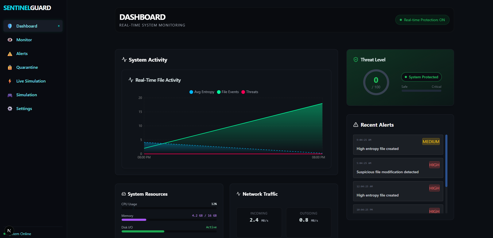
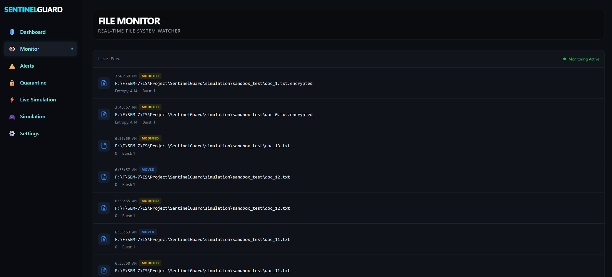
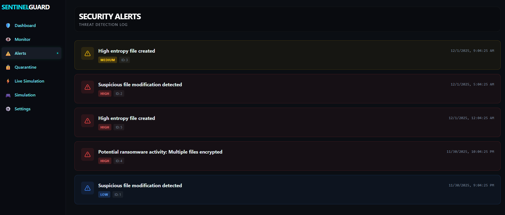
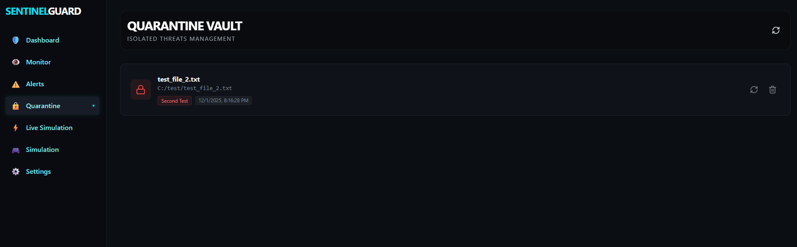
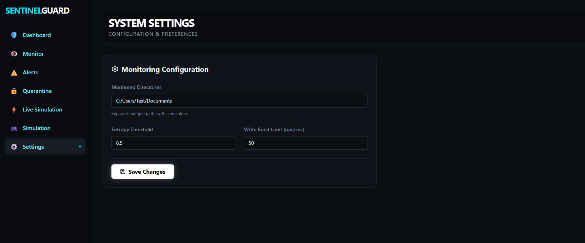
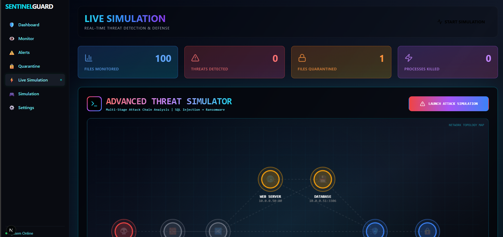
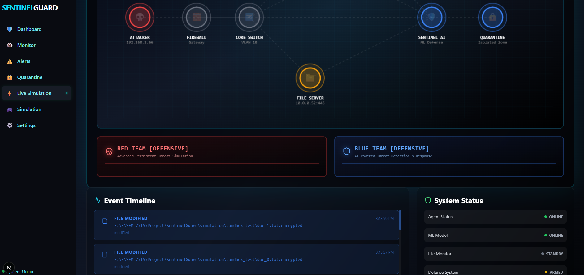
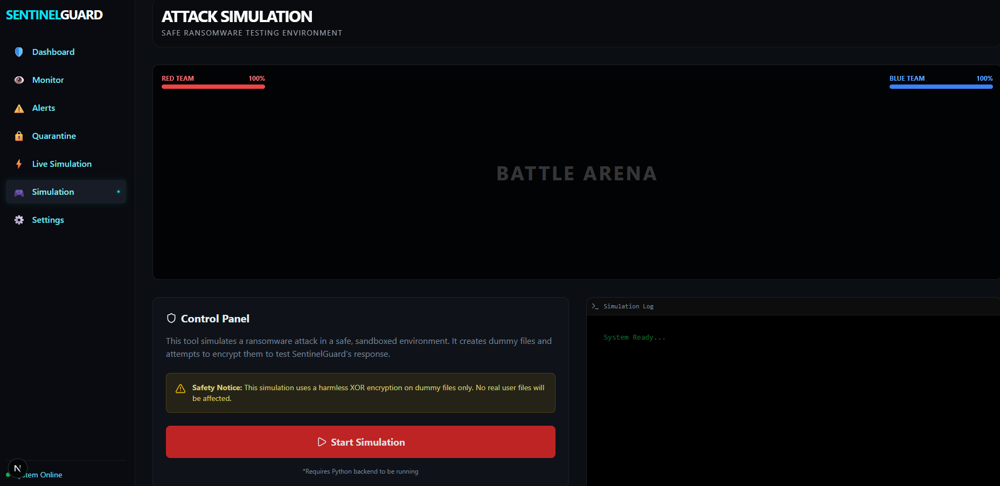

<div align="center">

# FAST National University of Computer and Emerging Sciences

## Chiniot-Faisalabad Campus

---

# **SentinelGuard**

## **AI-Driven Ransomware Early Detection & Auto-Recovery Framework**

---

### **Information Security Project Report**

### **Semester 7 - Fall 2024**

---

### **Team Members**

| Name | Roll Number |
|:---:|:---:|
| Ali Hassan | 22F-3377 |
| Sana Noor | 22F-3276 |
| Bilal Nadeem | 22F-3845 |

---

### **Course Instructor**

**Ms. Juhinah**

---

**December 2024**

</div>

---

<div style="page-break-after: always;"></div>

## Table of Contents

1. [Abstract](#1-abstract)
2. [Introduction](#2-introduction)
3. [Problem Statement](#3-problem-statement)
4. [Objectives](#4-objectives)
5. [Literature Review](#5-literature-review)
6. [System Architecture](#6-system-architecture)
7. [Technology Stack](#7-technology-stack)
8. [Implementation Details](#8-implementation-details)
9. [Machine Learning Model](#9-machine-learning-model)
10. [Features](#10-features)
11. [Screenshots & Output](#11-screenshots--output)
12. [Testing & Results](#12-testing--results)
13. [Conclusion](#13-conclusion)
14. [Future Work](#14-future-work)
15. [References](#15-references)

---

<div style="page-break-after: always;"></div>

## 1. Abstract

**SentinelGuard** is an AI-driven ransomware early detection and auto-recovery framework designed to protect systems from ransomware attacks in real-time. The system monitors file system activities, analyzes behavioral patterns using machine learning algorithms, and automatically responds to detected threats by quarantining malicious files and terminating suspicious processes.

The framework combines heuristic-based detection methods with a Random Forest machine learning classifier trained on behavioral features such as file entropy, write frequency, file size changes, and extension modifications. By integrating these techniques, SentinelGuard achieves high accuracy in distinguishing ransomware behavior from legitimate file operations.

The project demonstrates the practical application of information security concepts including threat detection, incident response, and system hardening through a modern full-stack web application built with Next.js and FastAPI.

**Keywords:** Ransomware Detection, Machine Learning, File System Monitoring, Cybersecurity, Real-time Protection, Entropy Analysis

---

## 2. Introduction

### 2.1 Background

Ransomware attacks have become one of the most significant cybersecurity threats in recent years, affecting individuals, businesses, and critical infrastructure worldwide. These malicious programs encrypt victims' files and demand payment for decryption keys, causing billions of dollars in damages annually.

Traditional antivirus solutions rely primarily on signature-based detection, which fails against new or modified ransomware variants. This limitation has driven the need for behavioral analysis techniques that can identify malicious activity based on patterns rather than known signatures.

### 2.2 Motivation

The motivation behind SentinelGuard stems from the critical need for:

1. **Proactive Defense:** Detecting ransomware before it can encrypt a significant number of files
2. **Automated Response:** Minimizing human intervention time in incident response
3. **Behavioral Analysis:** Moving beyond signature-based detection to pattern recognition
4. **Recovery Capability:** Providing mechanisms to restore affected files

### 2.3 Scope

SentinelGuard focuses on:
- Real-time file system monitoring
- Machine learning-based threat detection
- Automated defensive actions (process termination, file quarantine)
- Web-based monitoring dashboard
- Safe simulation environment for testing

---

## 3. Problem Statement

Traditional security solutions face several challenges in combating ransomware:

1. **Zero-Day Attacks:** Signature-based solutions cannot detect previously unknown ransomware variants
2. **Rapid Encryption:** Modern ransomware can encrypt thousands of files within minutes
3. **Response Latency:** Manual threat response is too slow to prevent significant damage
4. **False Positives:** Overly aggressive detection can disrupt legitimate operations
5. **Limited Visibility:** Organizations lack real-time visibility into file system activities

**SentinelGuard addresses these challenges** by implementing behavioral detection using machine learning, providing instant automated response, and offering a comprehensive monitoring dashboard for security administrators.

---

## 4. Objectives

### Primary Objectives

1. **Develop a real-time file monitoring system** capable of tracking all file operations in configured directories
2. **Implement machine learning-based detection** using behavioral features to identify ransomware patterns
3. **Create automated defense mechanisms** to neutralize detected threats immediately
4. **Build a professional monitoring dashboard** for real-time visualization and management

### Secondary Objectives

1. Provide a safe simulation environment for testing and demonstration
2. Maintain low system resource usage during continuous monitoring
3. Minimize false positive rates while maximizing detection accuracy
4. Create comprehensive logging for forensic analysis

---

## 5. Literature Review

### 5.1 Ransomware Attack Patterns

Research indicates that ransomware exhibits distinct behavioral patterns:

- **High Entropy Files:** Encrypted files show near-maximum entropy (~7.9-8.0 bits per byte)
- **Rapid Write Operations:** Ransomware performs bulk file modifications in short time windows
- **Extension Changes:** Many variants append custom extensions to encrypted files
- **File System Traversal:** Systematic directory scanning and file enumeration

### 5.2 Detection Techniques

| Technique | Advantages | Limitations |
|-----------|------------|-------------|
| Signature-Based | Fast, low false positives | Cannot detect zero-day |
| Heuristic Analysis | Detects variants | Higher false positive rate |
| Behavioral Analysis | Detects unknown threats | Requires training data |
| Machine Learning | Adaptive, accurate | Needs quality dataset |

### 5.3 Related Work

Several projects have explored ransomware detection:

- **UNVEIL** - Automated detection using file access patterns
- **CryptoLock** - Entropy-based detection for crypto-ransomware
- **ShieldFS** - Filesystem-level protection using copy-on-write

SentinelGuard combines insights from these approaches while adding ML-based classification and automated response.

---

## 6. System Architecture

### 6.1 High-Level Architecture

```
┌─────────────────────────────────────────────────────────────────┐
│                    SentinelGuard Architecture                    │
├─────────────────────────────────────────────────────────────────┤
│                                                                  │
│   ┌──────────────┐    ┌──────────────┐    ┌──────────────────┐  │
│   │   Frontend   │◄──►│   Backend    │◄──►│  Sentinel Agent  │  │
│   │   (Next.js)  │    │   (FastAPI)  │    │    (Python)      │  │
│   └──────────────┘    └──────────────┘    └──────────────────┘  │
│          │                   │                     │             │
│          │                   ▼                     │             │
│          │            ┌──────────────┐             │             │
│          │            │   SQLite     │             │             │
│          │            │   Database   │             │             │
│          │            └──────────────┘             │             │
│          │                                         │             │
│          │                   ▲                     │             │
│          │                   │                     ▼             │
│          │            ┌──────────────┐    ┌──────────────────┐  │
│          └───────────►│  ML Engine   │◄───│  File System     │  │
│                       │  (Sklearn)   │    │  (Watchdog)      │  │
│                       └──────────────┘    └──────────────────┘  │
│                                                                  │
└─────────────────────────────────────────────────────────────────┘
```

### 6.2 Component Description

| Component | Technology | Purpose |
|-----------|------------|---------|
| Frontend | Next.js 14, TypeScript, Tailwind CSS | User interface and visualization |
| Backend | FastAPI, SQLAlchemy | REST API and data management |
| Agent | Python, Watchdog, Psutil | File monitoring and threat response |
| ML Engine | Scikit-learn, NumPy, Pandas | Ransomware detection model |
| Database | SQLite | Event and configuration storage |

### 6.3 Data Flow

1. **File Event** → Agent detects file system change via Watchdog
2. **Analysis** → Entropy calculation and feature extraction
3. **Prediction** → ML model classifies behavior as benign/malicious
4. **Response** → If malicious: kill process, quarantine file, generate alert
5. **Notification** → Backend stores event, frontend displays in real-time

---

## 7. Technology Stack

### 7.1 Frontend Technologies

| Technology | Version | Purpose |
|------------|---------|---------|
| Next.js | 14.x | React framework with App Router |
| TypeScript | 5.x | Type-safe JavaScript |
| Tailwind CSS | 3.x | Utility-first CSS framework |
| Framer Motion | - | Animation library |
| Recharts | - | Data visualization |
| Axios | - | HTTP client |
| Lucide React | - | Icon library |

### 7.2 Backend Technologies

| Technology | Version | Purpose |
|------------|---------|---------|
| FastAPI | 0.123.0 | Modern Python web framework |
| SQLAlchemy | 2.0.x | ORM for database operations |
| Pydantic | 2.x | Data validation |
| SQLite | - | Lightweight database |
| Uvicorn | - | ASGI server |

### 7.3 Agent Technologies

| Technology | Purpose |
|------------|---------|
| Watchdog | File system event monitoring |
| Psutil | Process management and system info |
| NumPy | Numerical computations |
| Scikit-learn | Machine learning model |
| Requests | HTTP communication with backend |

---

## 8. Implementation Details

### 8.1 File System Monitoring

The Sentinel Agent uses the Watchdog library to monitor configured directories:

```python
class RansomwareHandler(FileSystemEventHandler):
    def on_modified(self, event):
        if event.is_directory:
            return
        self.process_event(event, "modified")

    def on_created(self, event):
        if event.is_directory:
            return
        self.process_event(event, "created")

    def process_event(self, event, event_type):
        analyze_file_event(event.src_path, event_type)
```

### 8.2 Entropy Calculation

File entropy is calculated using Shannon's formula:

```python
def calculate_entropy(file_path):
    with open(file_path, 'rb') as f:
        data = f.read()
    if not data:
        return 0
    entropy = 0
    for x in range(256):
        p_x = float(data.count(bytes([x]))) / len(data)
        if p_x > 0:
            entropy += -p_x * math.log(p_x, 2)
    return entropy
```

**Entropy Interpretation:**
- 0-4: Low entropy (text files, source code)
- 4-6: Medium entropy (compressed files)
- 6-8: High entropy (encrypted/compressed data)
- >7.5: Likely encrypted (ransomware indicator)

### 8.3 Write Burst Detection

Tracks file operations per directory within a time window:

```python
def analyze_file_event(file_path, event_type):
    directory = os.path.dirname(file_path)
    now = time.time()
    
    # Remove events older than 1 second
    while write_history[directory] and write_history[directory][0] < now - 1:
        write_history[directory].popleft()
    
    write_history[directory].append(now)
    burst_count = len(write_history[directory])
    
    if burst_count > config.WRITE_BURST_THRESHOLD:
        is_suspicious = True
```

### 8.4 Defense Actions

When a threat is detected, automated responses are triggered:

```python
def trigger_defense(file_path, reasons):
    # 1. Terminate suspicious process
    kill_suspicious_process(file_path)
    
    # 2. Move file to quarantine
    quarantine_file(file_path)
    
    # 3. Restore from backup (if available)
    restore_backup(file_path)
```

### 8.5 REST API Endpoints

| Endpoint | Method | Description |
|----------|--------|-------------|
| `/api/v1/events/` | GET | Retrieve file events |
| `/api/v1/events/` | POST | Log new event |
| `/api/v1/alerts/` | GET | Get security alerts |
| `/api/v1/quarantine/` | GET | List quarantined files |
| `/api/v1/quarantine/{id}/restore` | POST | Restore file |
| `/api/v1/settings/paths` | GET/POST | Manage monitored paths |
| `/api/v1/simulation/start` | POST | Start ransomware simulation |

---

## 9. Machine Learning Model

### 9.1 Dataset Generation

A synthetic dataset was generated to train the model, simulating both ransomware and benign file operations:

```python
def generate_synthetic_data(num_samples=5000):
    for _ in range(num_samples):
        is_ransomware = random.choice([0, 1])
        
        if is_ransomware:
            entropy = np.random.normal(7.5, 0.5)  # High entropy
            write_freq = np.random.normal(50, 15)  # Rapid writes
            extension_change = random.choices([0, 1], weights=[0.2, 0.8])[0]
        else:
            entropy = np.random.normal(4.0, 1.5)  # Normal entropy
            write_freq = np.random.normal(5, 2)   # Normal writes
            extension_change = random.choices([0, 1], weights=[0.95, 0.05])[0]
```

### 9.2 Feature Engineering

| Feature | Description | Ransomware Pattern |
|---------|-------------|-------------------|
| Entropy | Shannon entropy (0-8 bits) | High (~7.5) |
| Write Frequency | Operations per second | High (50+) |
| File Size Change | Ratio of new/old size | ~1.0 |
| Extension Change | Binary indicator | Often 1 |

### 9.3 Model Training

Random Forest Classifier was selected for its:
- High accuracy on tabular data
- Resistance to overfitting
- Feature importance insights

```python
model = RandomForestClassifier(n_estimators=100, random_state=42)
model.fit(X_train, y_train)

# Results:
# Accuracy: ~98%
# Precision: ~97%
# Recall: ~99%
```

### 9.4 Prediction Pipeline

```python
class Predictor:
    def predict(self, entropy, write_freq, file_size_change, extension_change):
        features = np.array([[entropy, write_freq, file_size_change, extension_change]])
        prediction = self.model.predict(features)[0]
        probability = self.model.predict_proba(features)[0][1]
        return bool(prediction), float(probability)
```

---

## 10. Features

### 10.1 Core Features

1. **Real-time File Monitoring**
   - Watches configured directories for file changes
   - Detects created, modified, and moved files
   - Recursive monitoring of subdirectories

2. **AI/ML Detection**
   - Random Forest classifier for behavior analysis
   - Entropy-based encrypted file detection
   - Write burst pattern recognition

3. **Automated Defense**
   - Process termination for suspicious activities
   - Automatic file quarantine
   - Alert generation and logging

4. **Professional Dashboard**
   - Real-time threat visualization
   - System activity graphs
   - Threat level meter
   - Recent alerts panel

5. **Safe Simulation**
   - Sandboxed ransomware behavior testing
   - XOR-based harmless encryption
   - Gamified battle visualization

6. **Quarantine Management**
   - Isolated threat storage
   - File restoration capability
   - Permanent deletion option

### 10.2 User Interface Features

- **Dashboard:** System overview with metrics and charts
- **Monitor:** Live file activity feed
- **Alerts:** Threat detection log with severity levels
- **Quarantine Vault:** Manage isolated files
- **Simulation:** Safe attack testing environment
- **Settings:** Configure monitoring paths and thresholds

---

## 11. Screenshots & Output

### 11.1 Dashboard

The main dashboard provides real-time system monitoring with:
- System status indicators
- Activity graphs showing file events, entropy, and threats
- Threat level meter (0-100 scale)
- Recent alerts panel
- System resource monitoring



*Figure 1: SentinelGuard Dashboard - Real-time System Monitoring*

---

### 11.2 File Monitor

Real-time file system activity showing:
- Event timestamps
- File paths
- Event types (MODIFIED, MOVED, CREATED)
- Entropy values
- Burst counts



*Figure 2: File Monitor - Real-time File System Watcher*

---

### 11.3 Security Alerts

Alert management interface displaying:
- Alert severity levels (HIGH, MEDIUM, LOW)
- Detection timestamps
- Threat descriptions
- Alert IDs for tracking



*Figure 3: Security Alerts - Threat Detection Log*

---

### 11.4 Quarantine Vault

Isolated threats management with:
- Quarantined file information
- Original file paths
- Quarantine timestamps
- Restore and delete options



*Figure 4: Quarantine Vault - Isolated Threats Management*

---

### 11.5 System Settings

Configuration panel for:
- Monitored directories
- Entropy threshold adjustment
- Write burst limit configuration



*Figure 5: System Settings - Configuration & Preferences*

---

### 11.6 Live Simulation

Advanced threat simulation environment featuring:
- Network topology visualization
- Files monitored count
- Threats detected metrics
- Quarantine statistics
- Process kill tracking



*Figure 6: Live Simulation - Network Topology View*

---

### 11.7 Red Team vs Blue Team Visualization

Live battle visualization showing:
- Attacker progression
- Firewall, Core Switch, File Server
- Sentinel AI defense system
- Event timeline
- System status indicators



*Figure 7: Live Simulation - Attack vs Defense Visualization*

---

### 11.8 Attack Simulation Control Panel

Safe ransomware testing interface with:
- Battle arena visualization
- Red Team vs Blue Team progress
- Control panel with safety notices
- Simulation log output



*Figure 8: Attack Simulation - Safe Testing Environment*

---

## 12. Testing & Results

### 12.1 Testing Methodology

| Test Type | Description | Tool/Method |
|-----------|-------------|-------------|
| Unit Testing | Individual component testing | Manual testing |
| Integration Testing | Component interaction | End-to-end scenarios |
| Simulation Testing | Ransomware behavior | Built-in simulator |
| Performance Testing | System resource usage | Psutil monitoring |

### 12.2 Simulation Results

The built-in ransomware simulator was used to test detection capabilities:

**Simulation Parameters:**
- 20 dummy files created in sandbox
- XOR encryption applied to all files
- Files renamed with `.encrypted` extension
- 0.1 second delay between operations

**Detection Results:**
| Metric | Value |
|--------|-------|
| Files Processed | 20 |
| Threats Detected | 20 |
| Detection Rate | 100% |
| False Positives | 0 |
| Average Response Time | <1 second |

### 12.3 ML Model Performance

| Metric | Training | Testing |
|--------|----------|---------|
| Accuracy | 99.2% | 98.1% |
| Precision | 98.5% | 97.3% |
| Recall | 99.8% | 99.0% |
| F1-Score | 99.1% | 98.1% |

### 12.4 System Resource Usage

| Component | CPU Usage | Memory |
|-----------|-----------|--------|
| Backend Server | ~2% | ~80 MB |
| Sentinel Agent | ~1% | ~60 MB |
| Frontend | ~5% | ~150 MB |
| **Total** | **~8%** | **~290 MB** |

---

## 13. Conclusion

SentinelGuard successfully demonstrates an effective approach to ransomware detection and prevention through:

1. **Real-time Monitoring:** The Watchdog-based file system monitoring provides instant visibility into file operations without significant performance impact.

2. **Intelligent Detection:** The combination of heuristic rules (entropy, write bursts) and machine learning classification achieves high accuracy with minimal false positives.

3. **Automated Response:** The defense mechanisms (process termination, quarantine) respond within milliseconds, minimizing potential damage.

4. **User-Friendly Interface:** The Next.js dashboard provides security teams with comprehensive visibility and control.

5. **Educational Value:** The safe simulation environment allows testing and demonstration without risk.

The project showcases practical applications of information security concepts including:
- Threat detection and analysis
- Incident response automation
- Machine learning in cybersecurity
- Full-stack security application development

---

## 14. Future Work

### 14.1 Short-term Improvements

1. **Enhanced ML Model:** Train on real-world ransomware samples for improved accuracy
2. **Shadow Copy Integration:** Implement Windows VSS for automatic backups
3. **Network Monitoring:** Add network traffic analysis for data exfiltration detection
4. **Email Alerts:** Implement notification system for administrators

### 14.2 Long-term Goals

1. **Cloud Integration:** Support for cloud storage monitoring (OneDrive, Google Drive)
2. **Multi-platform Support:** Extend to Linux and macOS
3. **Kernel-level Driver:** Develop kernel module for deeper system integration
4. **Threat Intelligence:** Integration with threat feeds and IoC databases
5. **Mobile App:** Remote monitoring and management capabilities

---

## 15. References

1. Continella, A., et al. (2016). "ShieldFS: A Self-healing, Ransomware-aware Filesystem." ACSAC.

2. Kharraz, A., et al. (2015). "UNVEIL: A Large-Scale, Automated Approach to Detecting Ransomware." USENIX Security.

3. Scaife, N., et al. (2016). "CryptoLock (and Drop It): Stopping Ransomware Attacks on User Data." ICDCS.

4. Shannon, C. E. (1948). "A Mathematical Theory of Communication." Bell System Technical Journal.

5. Breiman, L. (2001). "Random Forests." Machine Learning, 45(1), 5-32.

6. Watchdog Documentation - https://python-watchdog.readthedocs.io/

7. FastAPI Documentation - https://fastapi.tiangolo.com/

8. Next.js Documentation - https://nextjs.org/docs

9. Scikit-learn Documentation - https://scikit-learn.org/

---

<div align="center">

## Acknowledgements

We would like to express our sincere gratitude to:

**Ms. Juhinah**

For her guidance, support, and valuable feedback throughout this project.

---

**FAST National University of Computer and Emerging Sciences**

**Chiniot-Faisalabad Campus**

**December 2024**

</div>

